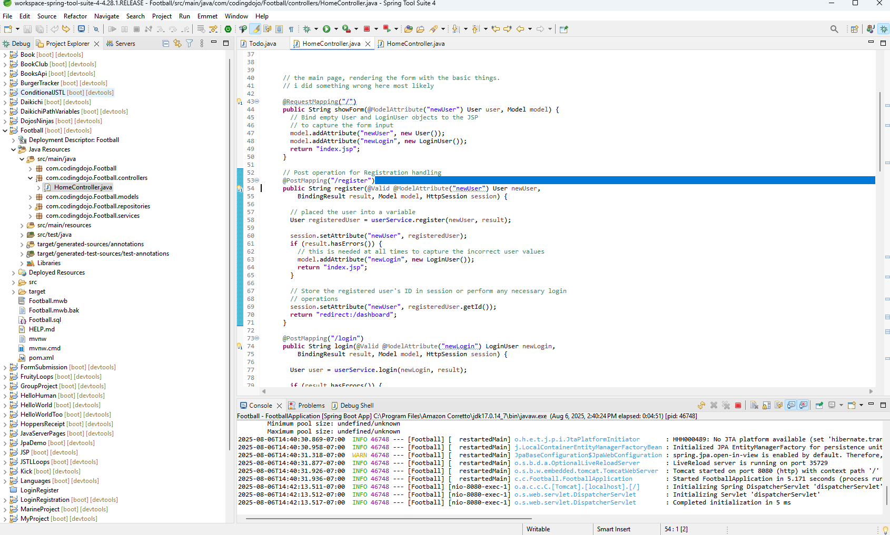
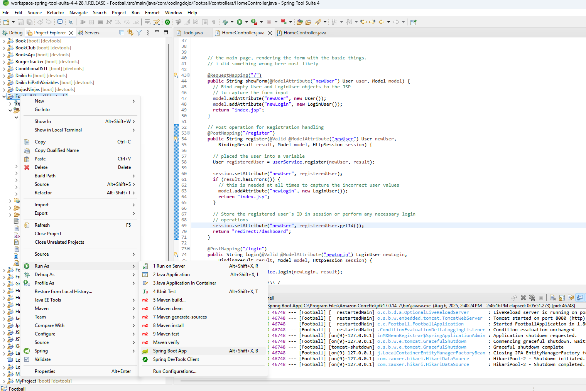
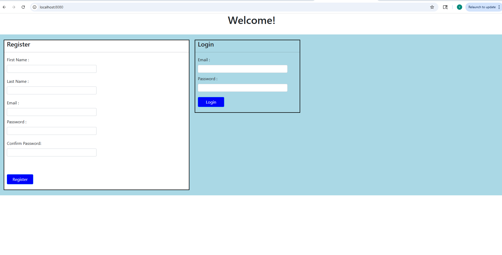
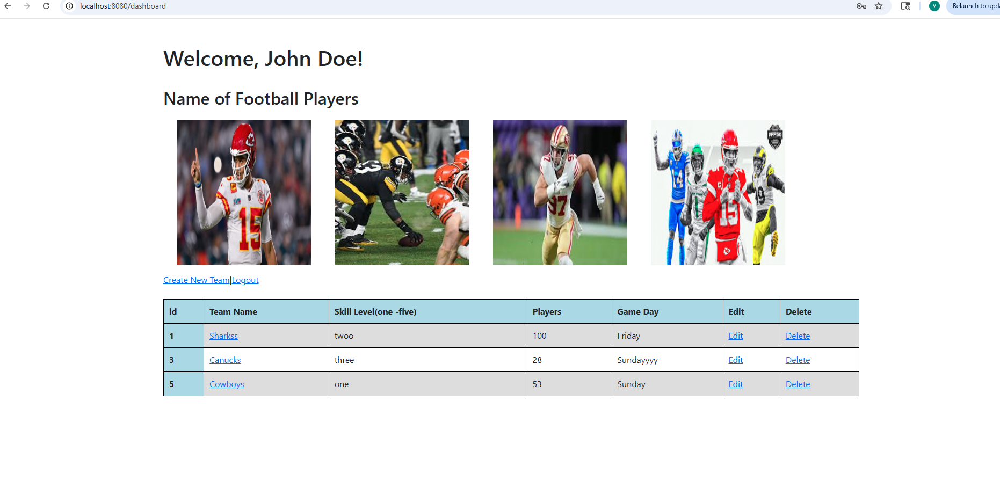
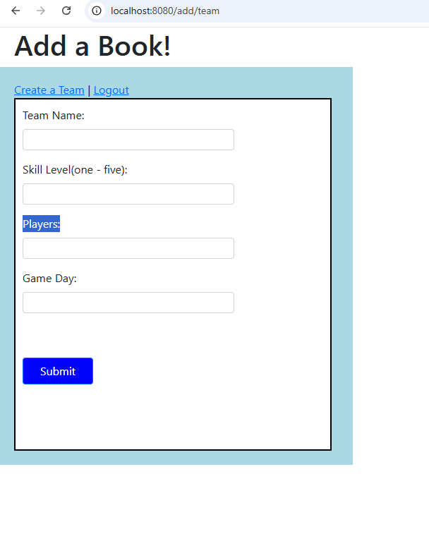
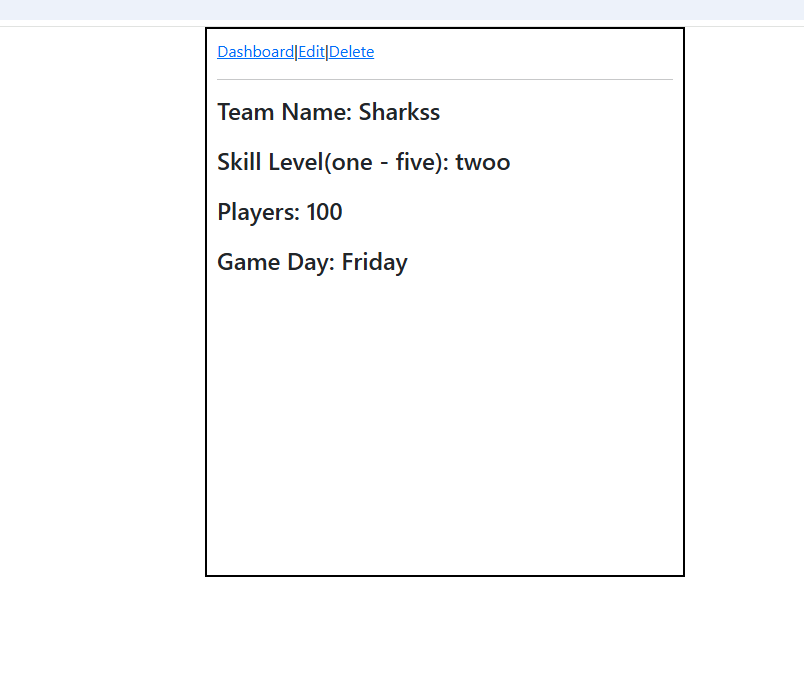
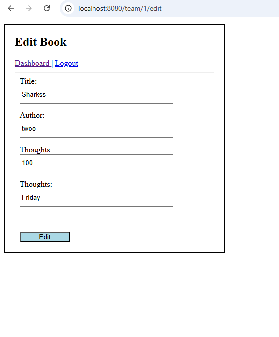
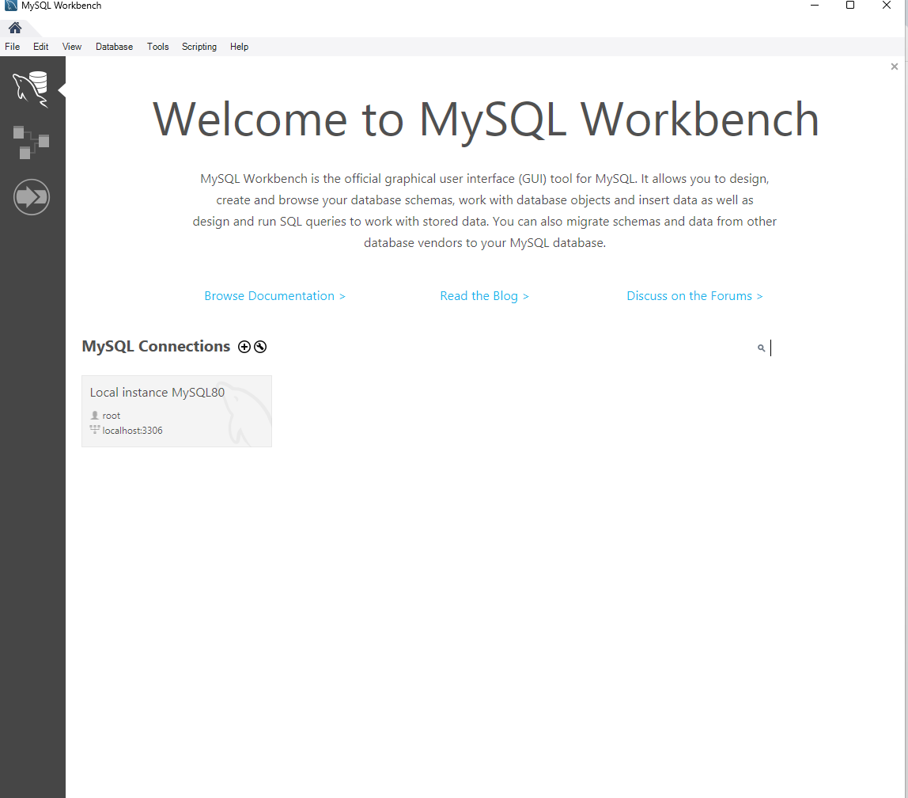
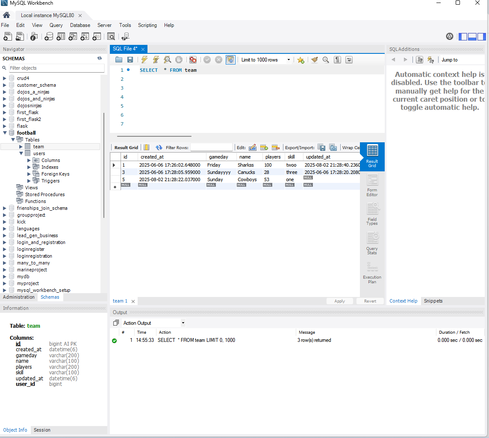

## Footbal Setup
** Run Spring tool Suite

** Go to the project-right click-Run as-Spring Tool App

## Register and Login Page
** It will take you here

** Register and Login

## Dashboard 

## CRUD

** Create

** Team 

** Edit

## MySQL Workbench
** click Local instance MySQL80: password:root

** Can see football table

