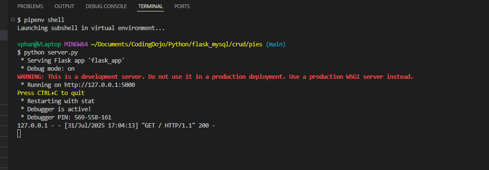
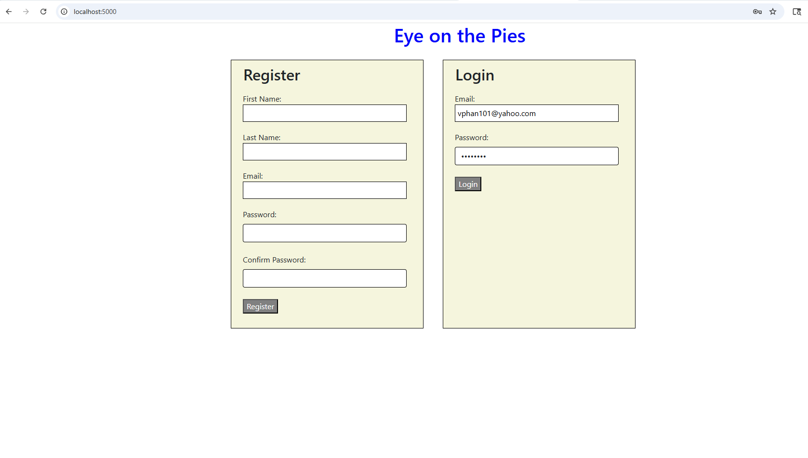

## Pies
Python | Flask | MySQL | Bootstrap 

## Run  app
:pipenv shell
:python server.py

## Open browser http://localhost:5000/

## Register and Login

## Take you to Dasboard 

## Create Pie  (top left of page)

## View Pie  -Back to Pies takes you back to the dashboard

## Edit 
